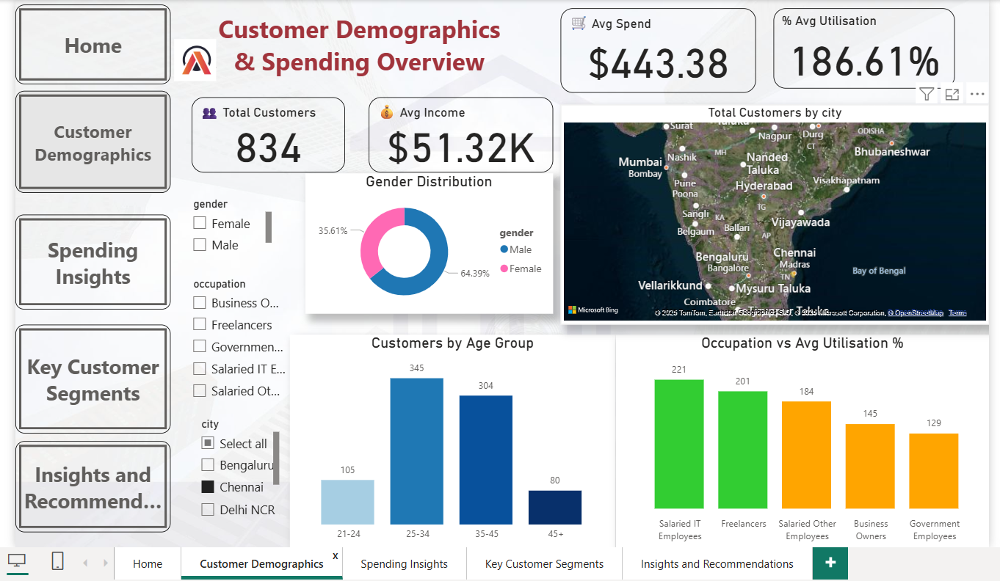
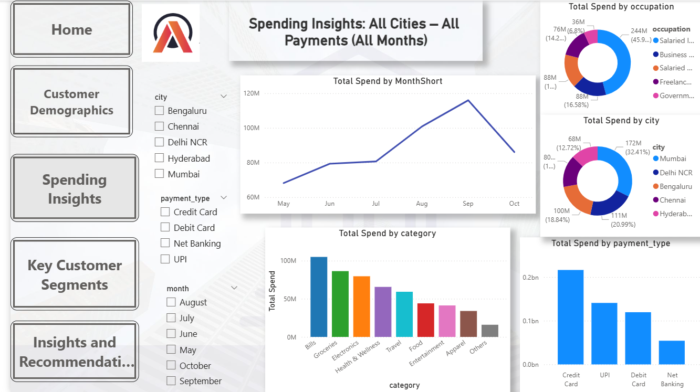
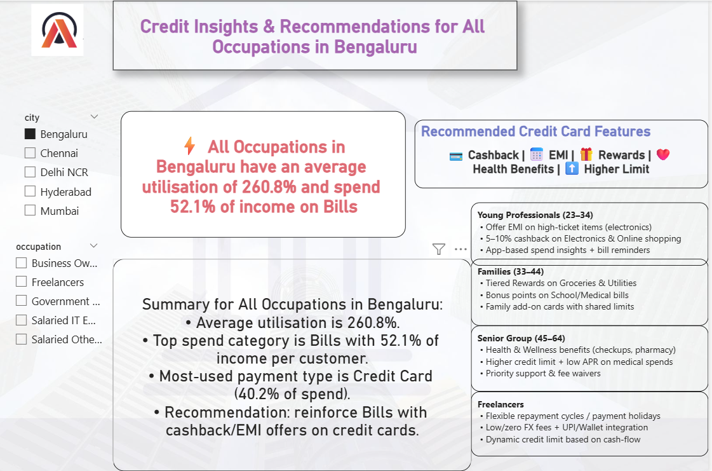

# Mitron Bank – Credit Card Insights Dashboard

📊 A Power BI dashboard created as part of **Codebasics Resume Project Challenge 8**.  
The objective was to help Mitron Bank design a new line of credit cards by analyzing customer demographics, spending patterns, and utilization trends.

## Key Insights
- 4,000 customers analyzed → IT employees & 25–35 age group dominate.
- $531M total spend → Credit cards contribute $216M (17.45% utilization).
- Mumbai leads customer base with 1,078 customers.
- IT employees show the highest % income utilization.
- Recommendations → Cashback, EMI, Rewards, Health Benefits, Higher Limits.

## 📷 Dashboards  

### 1️⃣ Home Page  

### 2️⃣ Customer Demographics  

### 3️⃣ Spending Insights  

### 4️⃣ Key Customer Segments  

### 5️⃣ Insights & Recommendations  

## Tools Used
- Power BI (Data Modeling, DAX, Visuals, Navigation)

## Live Dashboard
👉 https://app.powerbi.com/view?r=eyJrIjoiYzFkNmU3YTgtY2QxMC00NDdiLWEwYzktMjk3YTkzMGI4MjI2IiwidCI6ImM2ZTU0OWIzLTVmNDUtNDAzMi1hYWU5LWQ0MjQ0ZGM1YjJjNCJ9

